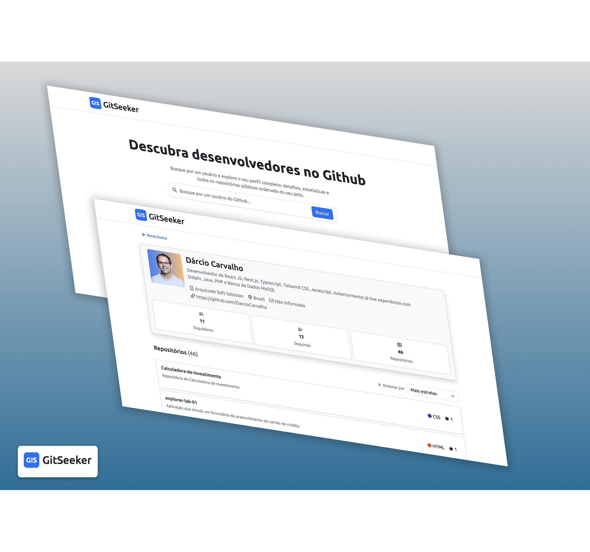

## Demonstração

🔗 Aplicação: https://gitseekerbr.netlify.app/

📸 Preview

<p align="center">
  
</p>


# GitSeeker

Aplicação web desenvolvida em React e TypeScript para busca e visualização de perfis do GitHub.

O sistema permite pesquisar usuários da plataforma GitHub, visualizar informações detalhadas do perfil, listar seus repositórios e consultar detalhes específicos de cada projeto.

---

## 📋 Funcionalidades

### Busca de Usuários

* Pesquisa de usuários do GitHub através do username.
* Validação da existência do usuário informado.
* Tratamento de erros para usuários inexistentes.

### Informações do Perfil

Exibição das principais informações públicas do usuário:

* Avatar
* Nome
* Username
* Bio
* E-mail
* Quantidade de seguidores
* Quantidade de usuários seguidos

### Listagem de Repositórios

* Listagem dos repositórios públicos do usuário.
* Ordenação inicial por número de estrelas.
* Alteração dinâmica dos critérios de ordenação por quantidade de estrela, nome e linguagem.
* Exibição da linguagem principal do projeto.
* Exibição da quantidade de estrelas.

### Detalhes do Repositório

Visualização individual contendo:

* Nome do repositório
* Descrição
* Linguagem principal
* Quantidade de estrelas
* Link para acesso direto ao repositório no GitHub

### Responsividade

A aplicação foi desenvolvida seguindo a abordagem Mobile First e utiliza o sistema do Bootstrap e Sass para adaptação em diferentes tamanhos de tela.

---

## 🚀 Tecnologias Utilizadas

### Front-end

* React 19
* TypeScript
* React Router DOM
* Bootstrap 5
* Sass
* React Icons

### Gerenciamento de Dados

* TanStack React Query
* Axios

### Ferramentas de Desenvolvimento

* Vite
* ESLint

---

## 🏗️ Arquitetura

O projeto foi organizado buscando separação de responsabilidades, reutilização de código e escalabilidade.

```text
src
│
├── assets
├── components
├── contexts
├── hooks
├── models
├── pages
├── providers
├── routes
├── services
├── utils
│
├── App.tsx
└── main.tsx
```

### Principais responsabilidades

| Diretório  | Responsabilidade            |
| ---------- | --------------------------- |
| components | Componentes reutilizáveis   |
| contexts   | Contexto para o Toast       |
| hooks      | Hooks customizados          |
| models     | Tipagens TypeScript         |
| pages      | Páginas da aplicação        |
| providers  | Provider para o React Query |
| routes     | Configuração das rotas      |
| services   | Comunicação com APIs        |
| utils      | Funções utilitárias         |

---

## 🔄 Fluxo da Aplicação

```text
Home
 │
 ├── Busca usuário
 │
 ├── Consulta API GitHub
 │
 ├── Usuário encontrado
 │        │
 │        └── Navega para Perfil
 │
 └── Usuário não encontrado
          │
          └── Exibe mensagem de erro

Perfil
 │
 ├── Consulta dados do usuário
 ├── Consulta repositórios
 └── Exibe informações

Detalhe do Repositório
 │
 └── Exibe informações detalhadas do projeto
```

---

## ⚡ Cache e Performance

A aplicação utiliza TanStack Query para gerenciamento de estado assíncrono e cache de requisições.

Benefícios obtidos:

* Cache automático de consultas
* Reutilização de dados entre páginas
* Redução de chamadas desnecessárias para a API
* Controle simplificado de estados de loading e erro

---

## 🌐 API Utilizada

GitHub REST API

Principais endpoints utilizados:

```http
GET /users/{username}
```

```http
GET /users/{username}/repos
```

```http
GET /repos/{owner}/{repo}
```

Documentação oficial:

https://docs.github.com/en/rest

---

## 📦 Instalação

Clone o repositório:

```bash
git clone https://github.com/DarcioCarvalho/gitseek
```

Acesse a pasta do projeto:

```bash
cd gitseeker
```

Instale as dependências:

```bash
npm install
```

---

## ▶️ Executando o Projeto

Ambiente de desenvolvimento:

```bash
npm run dev
```

Build de produção:

```bash
npm run build
```

Visualizar build local:

```bash
npm run preview
```

Executar lint:

```bash
npm run lint
```

---

## 📱 Responsividade

O layout foi construído utilizando Bootstrap, Sass e utilitários responsivos.

Compatível com:

* Smartphones
* Tablets
* Notebooks
* Monitores Desktop

---

## 🔍 Possíveis Evoluções

Algumas melhorias que podem ser implementadas futuramente:

* Paginação de repositórios
* Favoritos
* Tema Dark/Light
* Histórico de pesquisas
* Pesquisa por nome completo
* Testes unitários
* Testes de integração
* Internacionalização (i18n)

---

## 👨‍💻 Autor

Desenvolvido por Dárcio Nuno Carvalho.
_ArquiCode Soft Solution_

LinkedIn:
https://www.linkedin.com/in/darcio-nuno-carvalho

GitHub:
https://github.com/DarcioCarvalho
